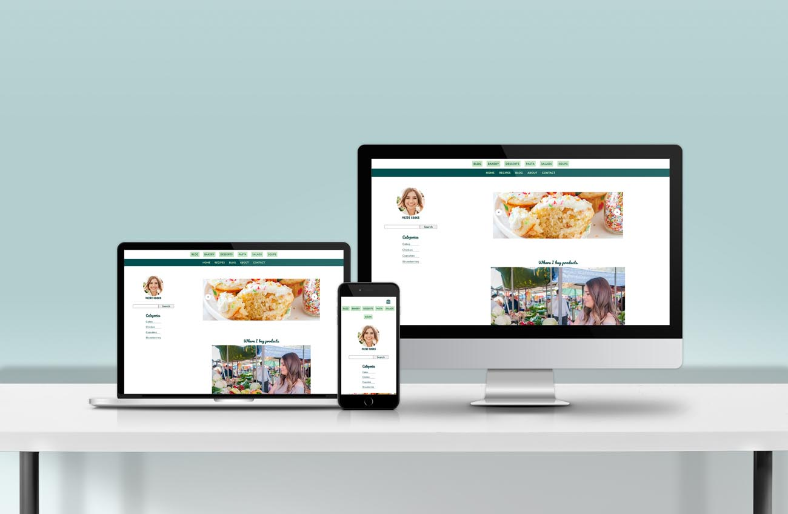

# Live Rock - Project Exam 1

<p align="center">
  
</p>

## Description

Create a blog site. You can choose the design and topics covered on the blog.

The content for your website will be stored on a WordPress installation used as a Headless CMS. It’s important to note that we are only using WordPress to provide an API and add content for the blog. You should not submit a link to a WordPress site, but build your website using HTML, CSS and JavaScript and making a call to the WordPress REST API to fetch the data.

### Project requirements

#### **_Home page_**

The home page should have a ‘Latest Posts’ section which uses a carousel (slider) for users to click to view more posts. For example, by default the user can see four posts, then they can click an arrow on the right to view the next four posts, and click it again to view the next four posts. The user can also click back to view results they had previously seen.

#### **_List of blog posts page_**

The blog posts page should show the first 10 blogs, and the user should click to view more results which then show underneath the first 10 blogs.

#### **_Specific blog post page_**

The content of the blog specific page should be dynamically built using a query string parameter based on whatever link the user clicked. The title of the blog specific page should change based on the blog that has been clicked on e.g. “My Blog | An Article I Wrote”.

If images on the blog post page are clicked, a modal should appear giving the user a bigger view of that image. Clicking outside the image should hide the modal.

#### **_Contact page_**

Create a contact us page, there should be 4 textboxes on this page.

- Name (Should be more than 5 characters long)
- Email address (Must be a valid email address)
- Subject (Should be more than 15 characters long)
- Message content (Should be more than 25 characters long)

Please use JavaScript for validation, show error messages if the values in the textboxes do not meet the requirements.

### Level 2 (optional)

1. You can try adding a sort, filter, or search to the blog posts page allowing users to find the blog post more easily that they’re looking for.
2. Post the data from the contact form to WordPress so you have the details saved.
   3- Allow users to submit comments on a blog post, and post this data to WordPress

## Built With


## Getting Started

### Installing

1. Clone the repo:

```bash
git clone git@github.com:Noroff-FEU-Assignments/project-exam-1-KarolinaSzymanska899.git
```

### Running

Using the liveServer extension for VScode:

Right click on the index.html and click view in live server. This will open [http://localhost:3000](http://localhost:3000) in your browser where you can see the result.

## Contact

[](https://www.linkedin.com/in/karolina-szyma%C5%84ska-64b36089/)
